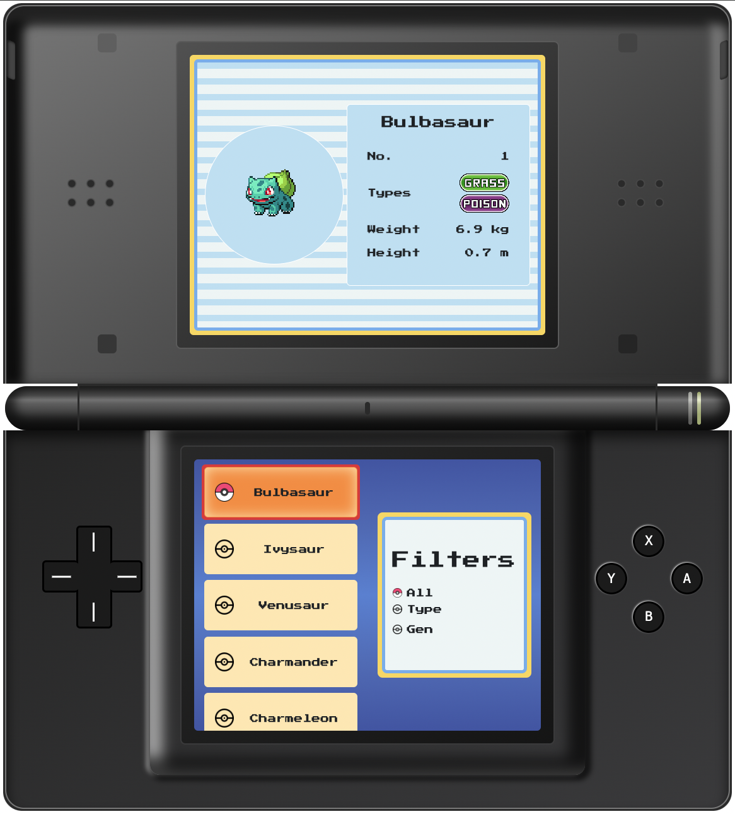

# Nintendo DSLite - Pokedex

# Pokedex ~ React/Typescript

This project was created with the goal of demonstrating my advanced skills in using various technologies and tools within the React and Typescript ecosystem. Through the implementation of modern development practices, the project highlights the following skills:

- Advanced use of React and Typescript: The project is developed entirely using React and Typescript, ensuring a solid, typed foundation for modern frontend application development.

- Leveraging React Hooks and Custom Hooks: Custom React Hooks and Hooks were used extensively to manage the internal state of components, improving the modularity and reusability of the code.

- Implementation of Context and Stores: Management of application state is entrusted to the use of Context and the creation of Stores, ensuring efficient data management with a clear separation of responsibilities between components.

- Integration of API calls: The project manages API calls efficiently.

You can take a look to the project [HERE](https://pokemon-ds.netlify.app/)

## Built With

- JavaScript
- Typescript
- SCSS
- HTML
- Bootstrap
- React

## Getting Started

To set up a local copy of the project

- `git clone git@github.com:helman101/pokedex-project.git`
- `cd pokedex-project`
- `yarn install`

## Run locally

- Now you are ready to run a local server
- Go to your command line and put `yarn run dev`
- Go to [localhost:5173](http://localhost:5173/)
- Try it!!

## Author

👤 **Andres Ortegon**

- GitHub: [@helman101](https://github.com/helman101)
- LinkedIn: [Andres Ortegon](https://www.linkedin.com/in/helman101/)

## 🤝 Contributing

Contributions, issues, and feature requests are welcome!

## Show your support

Give a ⭐️ if you like this project!

## 📝 [License](LICENSE)

Pokémon and Pokémon character names are trademarks of Nintendo.